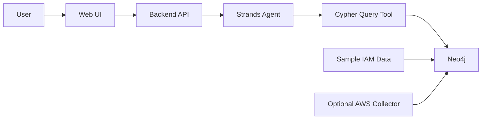

# Cloud Permission Risk Analyzer Plan

## Goal
Create a tool where a user can ask questions like:

- "Can this user delete production S3 buckets?"
- "Which identities can escalate to admin?"
- "Why is this role risky?"
- "What permission path leads from Alice to DynamoDB deletion?"

The core demo should show Neo4j graph traversal plus a Strands agent that turns graph results into a clear security explanation.

## MVP Architecture

## Graph Model
Use Neo4j to represent permission relationships:

- `User`: IAM user or human identity
- `Group`: IAM group
- `Role`: IAM role
- `Policy`: managed or inline policy
- `Statement`: policy statement
- `Action`: AWS action such as `s3:DeleteBucket`
- `Resource`: AWS resource such as `arn:aws:s3:::prod-bucket`
- `Service`: AWS service such as S3, IAM, Lambda

Important relationships:

- `(:User)-[:MEMBER_OF]->(:Group)`
- `(:User|Group|Role)-[:ATTACHED_TO]->(:Policy)`
- `(:Policy)-[:HAS_STATEMENT]->(:Statement)`
- `(:Statement)-[:ALLOWS]->(:Action)`
- `(:Statement)-[:ON_RESOURCE]->(:Resource)`
- `(:User|Role)-[:CAN_ASSUME]->(:Role)`
- `(:Action)-[:BELONGS_TO]->(:Service)`

## High-Impact Risk Queries
Implement 3-5 risk detectors first:

- **Admin access**: identities with `*:*`, `iam:*`, or `AdministratorAccess`.
- **Privilege escalation**: paths involving `sts:AssumeRole`, `iam:PassRole`, `iam:AttachRolePolicy`, `iam:CreatePolicyVersion`, or `lambda:CreateFunction`.
- **Destructive access**: identities that can delete S3 buckets, DynamoDB tables, IAM users, or KMS keys.
- **Public exposure risk**: S3 buckets or resources with broad access patterns.
- **Trust relationship risk**: roles assumable by broad principals or unexpected accounts.

## Strands Agent Tools
Give the Strands agent a small set of tools instead of letting it query everything freely:

- `run_cypher(query, params)`: execute approved read-only Cypher queries.
- `find_identity_risks(identity_name)`: return risk paths for one user/role.
- `find_privilege_escalation_paths()`: return likely escalation chains.
- `explain_policy(policy_id)`: summarize risky statements.
- `recommend_fix(risk_path)`: suggest least-privilege remediation.

The agent's job is to translate natural language into one of these tools, then explain the graph path in security language.

## Demo Scenario
Seed a small fictional AWS environment:

- `alice` is in `Developers` group.
- `Developers` can assume `DeployRole`.
- `DeployRole` can pass `LambdaAdminRole`.
- `LambdaAdminRole` has broad S3 or IAM permissions.
- `prod-bucket` is a sensitive resource.

Demo question:

> "Can Alice delete production data?"

Expected answer:

> Yes. Alice is a member of Developers, Developers can assume DeployRole, DeployRole can pass LambdaAdminRole, and LambdaAdminRole allows `s3:DeleteObject` on `prod-bucket`. Recommended fix: restrict `sts:AssumeRole`, limit `iam:PassRole`, and scope S3 actions to non-production resources.

## Implementation Phases

1. **Seeded graph demo**
   - Create sample IAM graph data.
   - Load it into Neo4j.
   - Verify Cypher queries return risky paths.

2. **Backend API**
   - Add endpoints for asking questions and running predefined risk detectors.
   - Connect backend to Neo4j.
   - Wrap risk queries as Strands tools.

3. **Strands agent**
   - Configure an agent with security-focused instructions.
   - Let it call the risk tools.
   - Return concise explanations with path evidence and remediation.

4. **Frontend**
   - Add a simple chat/question box.
   - Show agent answer.
   - Show the matched graph path as nodes/edges or a textual chain.

5. **Optional real AWS collector**
   - Read IAM users, groups, roles, policies, and trust policies using `boto3`.
   - Normalize them into the same Neo4j model.
   - Keep this read-only and clearly separate from the seeded demo.

## Recommended Tech Stack

Use the fastest stack for the hackathon:

- Backend: Python FastAPI
- Agent: AWS Strands Agents SDK
- Graph DB: Neo4j Aura or local Neo4j Docker
- AWS integration: `boto3` read-only IAM client
- Frontend: Streamlit for fastest demo, or Next.js if the team prefers a polished UI

## Success Criteria

The MVP is successful if it can:

- Load a sample AWS IAM graph into Neo4j.
- Answer at least 3 natural language security questions.
- Show the exact permission path behind each answer.
- Suggest a practical least-privilege fix.
- Optionally ingest real AWS IAM data without changing the analysis model.